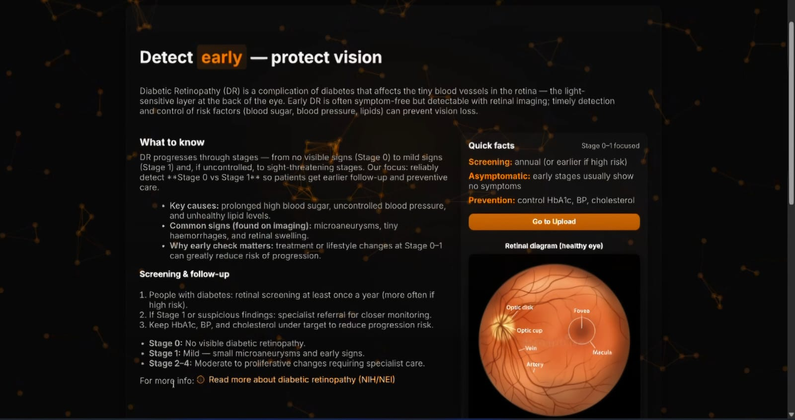
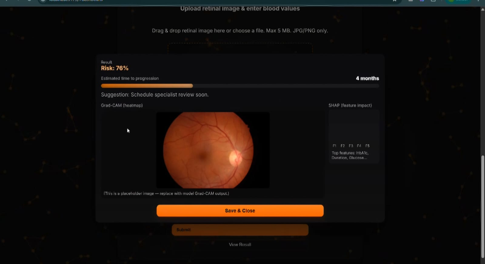

# 🩺 Multimodal AI Framework for Early-Stage Diabetic Retinopathy Detection

<p align="center">


</p>

---

##  Overview

Diabetic Retinopathy (DR) is one of the leading causes of preventable blindness among diabetic patients. Detecting **Stage 0 (No DR)** and **Stage 1 (Mild DR)** is particularly challenging because retinal abnormalities are extremely subtle.

This project presents a **multimodal deep learning framework** that combines:

-  Retinal Fundus Images
-  Clinical Biomarkers

to provide **early-stage diabetic retinopathy prediction**, calibrated risk estimation, explainable AI visualizations, and clinically interpretable outputs.

Unlike conventional DR classifiers that focus on all five severity stages, this work is specifically optimized for **Stage 0 vs Stage 1 detection**, where early diagnosis has the greatest impact on preventing vision loss.

---

#  Features

✅ Early Stage (0/1) DR Detection

✅ Multimodal AI (Image + Clinical Data)

✅ EfficientNet-B4 Image Classifier

✅ LightGBM Clinical Risk Model

✅ Logistic Fusion Meta Learner

✅ Grad-CAM Explainability

✅ SHAP Feature Importance

✅ Probability Calibration (Platt Scaling)

✅ Risk Percentage Prediction

✅ Estimated Progression Timeline

✅ Modern Flask Web Application

---

#  Application

## Home Page

The landing page educates users about diabetic retinopathy, explains the importance of early detection, and provides key screening recommendations before prediction.

<p align="center">

</p>

---

## Prediction Dashboard

Users upload a retinal fundus image and enter relevant clinical biomarkers. The system performs multimodal inference and generates:

- Risk percentage
- Estimated progression time
- Clinical recommendation
- Grad-CAM visualization
- SHAP explanation

<p align="center">

</p>

---

#  Model Architecture

```
                 Retinal Fundus Image
                          │
                          ▼
                  EfficientNet-B4
                          │
                 Calibrated Probability
                          │
                          ├────────────┐
                          │            │
Clinical Biomarkers       │            ▼
(HbA1c, Age,              │      Entropy Features
Glucose, Cholesterol      │
Duration)                 │
        │                 │
        ▼                 │
     LightGBM             │
        │                 │
 Calibrated Probability───┘
               │
               ▼
      Logistic Fusion Model
               │
               ▼
     Final Risk Prediction
```

---

# 📊 Clinical Biomarkers Used

| Feature | Description |
|----------|-------------|
| HbA1c | Long-term blood sugar level |
| Fasting Glucose | Current blood glucose |
| Cholesterol | Lipid profile |
| Age | Patient age |
| Duration of Diabetes | Years since diagnosis |

---

# 🏗 Tech Stack

### Frontend

- HTML
- CSS
- JavaScript

### Backend

- Flask
- Python

### Machine Learning

- PyTorch
- EfficientNet-B4
- LightGBM
- Logistic Regression
- Scikit-learn

### Explainability

- Grad-CAM
- SHAP


# ⚙️ Workflow

1. Upload retinal fundus image.
2. Enter clinical biomarkers.
3. Image is processed using EfficientNet-B4.
4. Clinical data is analyzed using LightGBM.
5. Probabilities are calibrated using Platt Scaling.
6. Logistic Fusion combines both modalities.
7. Final risk score is generated.
8. Grad-CAM highlights retinal regions.
9. SHAP explains clinical feature importance.
10. Clinical recommendation is displayed.

---

# 📈 Performance

| Model | Accuracy | AUC | Recall | Precision |
|--------|---------:|----:|--------:|----------:|
| Image Only | 60.66% | 0.655 | 43.63% | 66.94% |
| Tabular Only | 90.35% | 0.974 | 88.96% | 91.68% |
| **Multimodal Fusion** | **90.46%** | **0.972** | **88.85%** | **91.98%** |

---

# 🔍 Explainable AI

To improve clinical trust, the framework provides:

### Grad-CAM
Highlights retinal regions responsible for predictions.

### SHAP
Shows the contribution of clinical biomarkers such as:

- HbA1c
- Glucose
- Age
- Cholesterol
- Diabetes Duration

---

